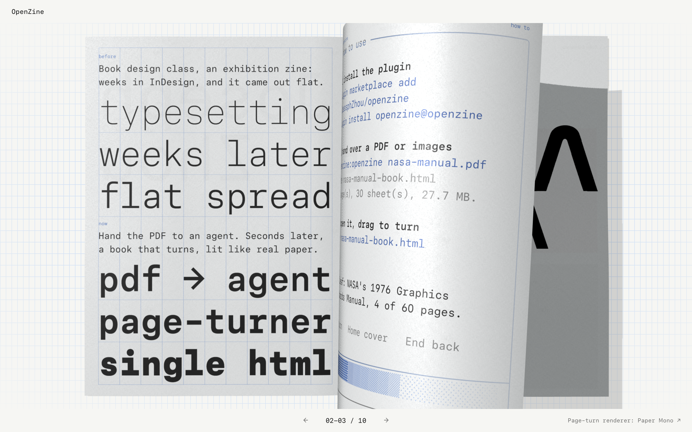
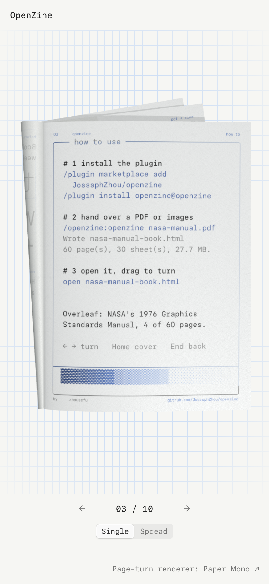

# OpenZine

**把一个 PDF 或一组页面图片做成能翻页的 3D 小册子，输出一个断网也能打开的网页文件。**
**安装：** 在 Claude Code 里运行 `/plugin marketplace add JosssphZhou/openzine`，再运行 `/plugin install openzine@openzine`。Codex 的装法见[复制一个文件夹](#codex)。
**使用：** 对你的 agent 说「把 `portfolio.pdf` 做成翻页小册子」，或者运行 `node scripts/make-book.mjs --input portfolio.pdf --out portfolio.html`。

[English](README.md)



> **来源说明。** 翻页渲染器、纸张着色器和纸纹贴图提取自 Paper 的 [paper.design/mono](https://paper.design/mono) 页面，版权归 **Paper** 所有，不在本仓库的 MIT 许可证范围内。随附的 [Three.js](https://threejs.org) r162 使用 MIT 许可证，界面字体 [Paper Mono](https://github.com/paper-design/paper-mono) 使用 SIL Open Font License 1.1。每本生成的小册子在页脚都链接到 paper.design/mono。哪些文件适用哪种条款，见 [LICENSE](LICENSE)。

## 能得到什么

把设计稿、作品集、产品目录或展览册子的 PDF 或图片文件夹交给 agent，几秒钟后得到一个 `.html` 文件：

- 翻页时纸张会弯曲、反光、投下阴影，纸面有纸纹。
- 读者可以拖动或点击书页翻页，按住连续翻页，也可以用左右方向键、Home 和 End 键。
- 图片、渲染器和纸纹都在文件里。双击就能打开，可以直接发邮件，也可以放到任何静态网站上，打开时不发任何网络请求。

不需要 InDesign，不需要写代码，也不需要注册账号。

## 安装

### Claude Code

```sh
/plugin marketplace add JosssphZhou/openzine
/plugin install openzine@openzine
```

从本地克隆安装时，把仓库名换成文件夹路径：`/plugin marketplace add ./openzine`。技能的调用名是 `/openzine:openzine`。你说要做翻页书、小册子或 zine 时，Claude 也会自己用上它。

### Codex

Codex 从 `~/.codex/skills` 读取技能。把技能文件夹复制过去，然后重启 Codex：

```sh
git clone https://github.com/JosssphZhou/openzine
cp -R openzine/plugins/openzine/skills/openzine ~/.codex/skills/openzine
```

之后直接让 Codex 做翻页小册子，或者在消息里写 `$openzine`。

### 其他 agent 或手动使用

技能就是 `plugins/openzine/skills/openzine` 这个文件夹，只需要 Node.js 18 或更新版本。让你的 agent 读里面的 `SKILL.md`，或者自己运行命令。

## 使用

```sh
node scripts/make-book.mjs --input <文件夹或PDF> --out <输出.html> [--title "书名"] [--lang en|zh] [--portrait single|spread]
```

`--lang zh` 让翻页界面显示中文，默认是英文。先用自带的演示页试一次：

```sh
node scripts/make-book.mjs --input examples/demo-pages --out demo.html --title "OpenZine 演示" --lang zh
```

书页规则：

- 按文件名自然排序（`2.png` 排在 `10.png` 前面）。第一页是封面，最后一页是封底。
- 页数为奇数时，末尾自动补一页空白。
- 支持 PNG、JPG、WebP、AVIF。文件夹里的其他文件会被跳过，并在输出里列出。
- 单页宽高比是 **1 : 1.377**（例如 1440 × 1983 像素）。其他比例会完整显示在纸色留白上，不裁切也不拉伸。
- PDF 会先把每页转成 1440 像素宽的 JPG：装了 Poppler 的 `pdftoppm` 就用它，没装就用 pdf.js（需要先在技能文件夹里运行一次 `npm install`）。用 `--pdf-engine pdftoppm|pdfjs` 可以指定其中一种。
- 横屏显示双页。竖屏默认用 Paper 的手机单页渲染器，页码下方有「单页 / 双页」切换；加 `--portrait spread` 让竖屏一打开就是双页。

<p align="center"></p>

出错时，命令会打印 `Error:`、原因和处理办法，然后以退出码 1 结束。

## 重新构建翻页界面

```sh
npm install
npm run verify:source   # 把 book.js 和 mobile-book.js 与 Paper 的发布代码逐个语法节点比对
npm run build           # 生成 plugins/openzine/skills/openzine/runtime/openzine.js
```

`verify:source` 确认提取的渲染器和 Paper 发布的函数只在四处有记录的地方不同：起始展开页可配置、纸纹地址改为本地、增加翻页回调、清理函数换成控制对象。16 段着色器模板字符串完全一致，纸纹文件的 SHA-256 与下载记录一致。`mobile-book.js` 用同样的方法与 Paper 的手机函数比对：14 段着色器模板字符串完全一致，只允许三处不同：纸纹地址改为本地、增加一处翻页回调、清理函数换成控制对象。手机相机画框常量也和 Paper 发布的数值比对。

## 限制

- 需要 WebGL。很旧的浏览器或关闭了硬件加速的浏览器会显示加载失败。
- 所有书页都嵌在文件里，60 页的大尺寸 PNG 可能超过 100 MB。用 1440 像素宽左右的 JPG 可以让文件小很多。

## 许可证

分几部分。OpenZine 自己的代码使用 MIT 许可证。Paper 的渲染器、着色器和纸纹版权归 Paper。Three.js 使用 MIT 许可证。Paper Mono 字体使用 SIL OFL 1.1。[LICENSE](LICENSE) 列出了每部分包含哪些文件。
