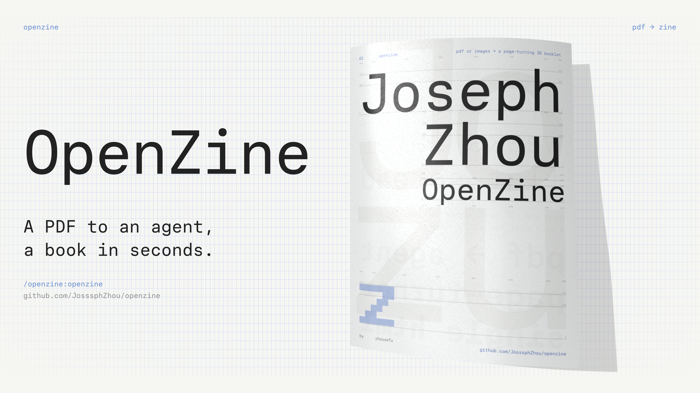

**OpenZine 是一个 agent 技能：把一个 PDF 或一组页面图片做成能在浏览器里翻的 3D 小册子。**

**在线试翻：** [在浏览器里翻一本做好的小册子](https://openzine.pen-ine.workers.dev)。[English](README.md)

翻页渲染器、纸张着色器和纸纹来自 Paper 的 [paper.design/mono](https://paper.design/mono)，版权归 Paper 所有，不在本仓库的 MIT 许可证范围内。详见[致谢](#致谢)。

## 能做什么

### 像纸一样翻页

每一页翻动时都会弯曲、反光，并在下面那页投下阴影。纸面带纸纹。


### 几种翻页方式

- 用鼠标拖动书页。松手后，书页带着你拖动的速度落到另一边；拖得不够远就落回原处。
- 点击书页翻一页。
- 在书页上按住不放，会一页接一页地连续翻，越翻越快。
- 按左右方向键翻一页。按 Home 回到封面，按 End 跳到封底。

### 封面和封底

第一页是封面，一打开是合上的，像一本真的小册子。最后一页是封底。

### 手机

竖屏一次显示一页，用的是 Paper 的手机渲染器。页码下方有「单页 / 双页」切换，切换后仍停在你正在看的那一页。

<p align="center"></p>

### PDF 和图片文件夹

- 可以用 PDF（扫描版也行），也可以用一个装着 PNG、JPG、WebP 或 AVIF 页面的文件夹。
- 比例不同的页面会完整显示在纸色留白上，不裁切，也不拉伸。
- 一份 60 页的 NASA 图形标准手册 PDF，从下命令到做好小册子用了 19 秒。

### Claude Code 和 Codex 都能用

OpenZine 可以装成 Claude Code 插件，也可以装成 Codex 技能。其他能读 `SKILL.md`、能运行 Node.js 的 agent 也能用。

做出来的是一个 `.html` 文件，书页、渲染器和纸纹都在里面。打开时不发任何网络请求，可以直接发邮件，也可以放到任何静态网站上。

## 安装

### Claude Code

```sh
/plugin marketplace add JosssphZhou/openzine
/plugin install openzine@openzine
```

从本地克隆安装时，把仓库名换成文件夹路径：`/plugin marketplace add ./openzine`。技能的调用名是 `/openzine:openzine`。你说要做翻页书、小册子或 zine 时，Claude 也会自己用上它。

### Codex

Codex 从 `~/.codex/skills` 读取技能。把技能文件夹复制过去，然后重启 Codex：

```sh
git clone https://github.com/JosssphZhou/openzine
cp -R openzine/plugins/openzine/skills/openzine ~/.codex/skills/openzine
```

之后直接让 Codex 做翻页小册子，或者在消息里写 `$openzine`。

### 其他 agent 或手动使用

技能就是 `plugins/openzine/skills/openzine` 这个文件夹，只需要 Node.js 18 或更新版本。让你的 agent 读里面的 `SKILL.md`，或者自己运行命令。

## 使用

对你的 agent 说「把 `portfolio.pdf` 做成翻页小册子」，或者运行命令：

```sh
node scripts/make-book.mjs --input <文件夹或PDF> --out <输出.html> [--title "书名"] [--lang en|zh] [--portrait single|spread]
```

仓库根目录的 `scripts/make-book.mjs` 会转交给 `plugins/openzine/skills/openzine/scripts/make-book.mjs`。`--lang zh` 让翻页界面显示中文，默认是英文。先用自带的演示页试一次：

```sh
node scripts/make-book.mjs --input examples/demo-pages --out demo.html --title "OpenZine 演示" --lang zh
```

出错时，命令会打印 `Error:`、原因和处理办法，然后以退出码 1 结束。

## 书页规则

- 按文件名自然排序（`2.png` 排在 `10.png` 前面）。第一页是封面，最后一页是封底。
- 页数为奇数时，末尾自动补一页空白。
- 支持 PNG、JPG、WebP、AVIF。文件夹里的其他文件会被跳过，并在输出里列出。
- 单页宽高比是 **1 : 1.377**（例如 1440 × 1983 像素）。其他比例会完整显示在纸色留白上，不裁切也不拉伸。
- PDF 会先把每页转成 1440 像素宽的 JPG：装了 Poppler 的 `pdftoppm` 就用它，没装就用 pdf.js（需要先在技能文件夹里运行一次 `npm install`）。用 `--pdf-engine pdftoppm|pdfjs` 可以指定其中一种。
- 横屏显示双页。竖屏默认用 Paper 的手机单页渲染器，页码下方有「单页 / 双页」切换；加 `--portrait spread` 让竖屏一打开就是双页。

## 限制

- 需要 WebGL。很旧的浏览器或关闭了硬件加速的浏览器会显示加载失败。
- 所有书页都嵌在文件里，60 页的大尺寸 PNG 可能超过 100 MB。用 1440 像素宽左右的 JPG 可以让文件小很多。

## 目录结构

```text
.claude-plugin/marketplace.json     Claude Code 插件市场入口
plugins/openzine/                   可安装的插件
  .claude-plugin/plugin.json
  skills/openzine/
    SKILL.md                        给 agent 的说明
    scripts/make-book.mjs           生成命令（没有依赖）
    runtime/openzine.js             预先构建好的翻页界面：Paper 渲染器 + Three.js + 界面外壳
    runtime/grain.webp              Paper 的纸纹贴图
    runtime/PAPERMONO-OFL.txt       翻页界面所用 Paper Mono 字体的许可证
    package.json                    可选的 pdf.js 备用依赖
renderer/                           runtime/openzine.js 的源码
  src/book.js, loader.js, performance.js   提取自 paper.design/mono（双页）
  src/mobile-book.js                提取自 paper.design/mono（竖屏单页）
  src/viewer.js                     OpenZine 的界面外壳
  vendor/three.module.min.js        同一个 Paper 发布包里的 Three.js r162
  vendor/PaperMono.woff2            Paper Mono 字体（SIL OFL 1.1），嵌入翻页界面
  reference/                        Paper 发布的原始文件，用于比对
examples/demo-pages/                八张演示页
evidence/                           截图和来源比对记录
```

## 重新构建翻页界面

```sh
npm install
npm run verify:source   # 把 book.js 和 mobile-book.js 与 Paper 的发布代码逐个语法节点比对
npm run build           # 生成 plugins/openzine/skills/openzine/runtime/openzine.js
```

`verify:source` 确认提取的渲染器和 Paper 发布的函数只在四处有记录的地方不同：起始展开页可配置、纸纹地址改为本地、增加翻页回调、清理函数换成控制对象。16 段着色器模板字符串完全一致，纸纹文件的 SHA-256 与下载记录一致。`mobile-book.js` 用同样的方法与 Paper 的手机函数比对：14 段着色器模板字符串完全一致，只允许三处不同：纸纹地址改为本地、增加一处翻页回调、清理函数换成控制对象。手机相机画框常量也和 Paper 发布的数值比对。

## 致谢

翻页渲染器、纸张着色器和纸纹贴图提取自 Paper 的 [paper.design/mono](https://paper.design/mono) 页面，版权归 **Paper** 所有，不在本仓库的 MIT 许可证范围内。随附的 [Three.js](https://threejs.org) r162 使用 MIT 许可证，界面字体 [Paper Mono](https://github.com/paper-design/paper-mono) 使用 SIL Open Font License 1.1。每本生成的小册子在页脚都链接到 paper.design/mono。哪些文件适用哪种条款，见 [LICENSE](LICENSE)。

## 许可证

分几部分。OpenZine 自己的代码使用 MIT 许可证。Paper 的渲染器、着色器和纸纹版权归 Paper。Three.js 使用 MIT 许可证。Paper Mono 字体使用 SIL OFL 1.1。[LICENSE](LICENSE) 列出了每部分包含哪些文件。
